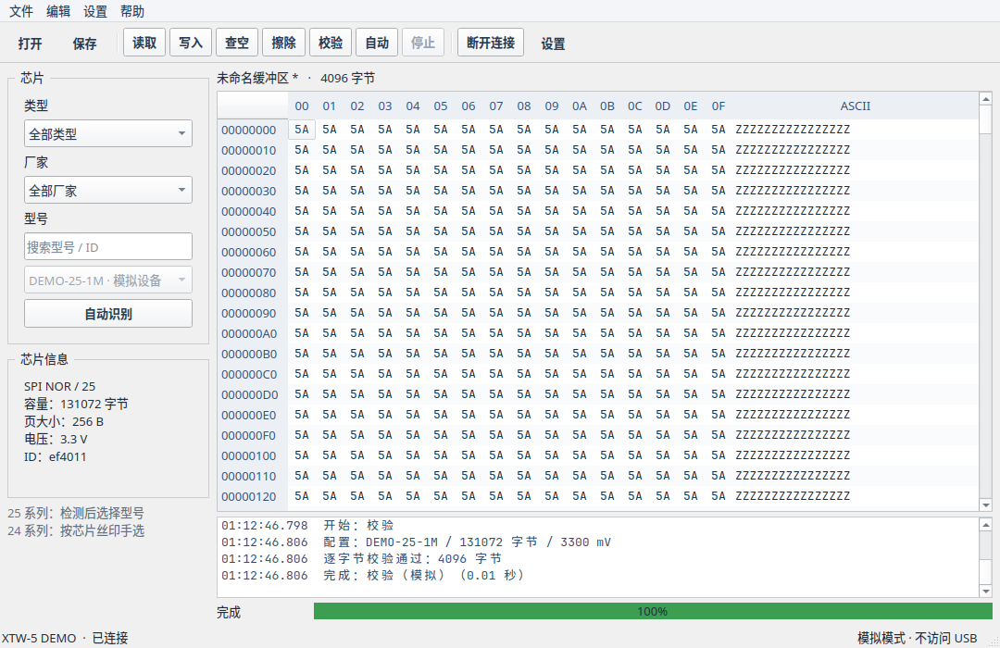

# XTW Studio

原生 Linux XTW-5 图形编程器，使用 **Qt 6 Widgets、C++20 和 libusb**。不依赖 Windows、Wine 或虚拟机。

当前状态：可运行的开发预览版。GUI、芯片库导入和离线模拟测试已完成；真实设备连接、信息查询、C84017 芯片识别及按 GD25Q64C 参数两次 8 MiB 整片读取已通过，两个文件逐字节一致。当前 C84017 芯片已完成授权擦除 / 查空、8 MiB 测试写入及独立读取比对、校验正反例，并已恢复原备份，独立复核哈希相同。**其他芯片及异常拔插仍待硬件验收**。模拟通过不代表真实芯片已验证。



## 界面与操作

布局参考原厂资料包中的《XTW-5 编程器一分钟上手指南》：顶部为打开、保存、读取、写入、查空、擦除、校验、自动、停止；左侧为类型、厂家、型号和检测；右侧为数据，下方为日志与进度。窗口默认 1080×700。

- 启动后自动连接已插入的编程器；运行中也每秒检查 USB 插拔。连接成功后自动识别一次主插座芯片，匹配后默认采用芯片库第一项（与 Windows 的 AutoDetect 默认设置一致），可在候选列表切换。厂家指南说明检测用于 25 SPI FLASH；24 EEPROM 请按丝印手选。
- 仅更换芯片、不拔插 USB 时，点击左侧“自动识别”。拔出编程器会中止当前任务并保留缓冲区，重新插入后自动连接，不会自动恢复烧录。手动断开后保持断开，直到重新插拔或手动连接。
- 连接失败最多自动尝试三次；仍失败可查看日志、修复权限后点击连接。多台编程器同时接入时不会任意挑选。模拟模式不监测真实 USB。
- “设置 → 编程器设置”中调整连接方式、插座、SPI 速率、操作范围和 USB 报文记录。模拟模式也在这里切换。
- 文件的新建、另存为和 SHA-256 信息在“文件”菜单；填充、补齐整页、查找、跳转在“编辑”菜单。
- 芯片库导入、自定义芯片、导出日志在“设置”菜单。设备详细信息可悬停底部连接状态查看。

此次对齐主界面布局与常用入口，未实现的硬件功能仍以以下限制为准。

## 已实现的功能

- 连接 / 断开 XTW-5；读取设备信息；SPI 速率设置；独立的离线模拟模式。
- 原厂 20250524 芯片库导入、型号 / 厂商 / JEDEC ID 搜索、同 ID 多型号保留、自定义参数。
- 独立“自动识别”：连接后无需预选型号，直接读取主插座芯片 ID；默认自动采用首个匹配项；可在设置中关闭，改为多候选手选。24 系列只筛选 EEPROM 候选，不推断容量。此操作不执行擦除或烧录；低电压芯片需事先接好适配器。C84017 识别已实测，其他型号待验收。
- SPI NOR（25 系列）与 I²C EEPROM（24 系列）的识别、读取、查空、擦除 / 清空、写入、校验和自动流程代码。
- 写入始终回读逐字节校验；实机首次数据不符时记录差异、重新配置并完整重读最多一次，仍不符则失败。擦除始终全片查空。普通“写入”不隐式擦除，自动流程为全片擦除 → 写入 → 校验。
- BIN / ROM / Intel HEX 文件读写；HEX 校验和、重叠记录和地址范围检查；文件原子保存。
- 按需显示的十六进制编辑器、ASCII、填充、页对齐补齐、查找、跳转、SHA-256。
- 后台 USB 任务、进度、停止、错误日志、可选 USB 报文记录与日志导出。
- udev 权限规则和桌面启动入口。

## 范围与限制

- 全库有 1173 条记录，条目数量不是已验证芯片数量。当前操作实现覆盖厂家协议类型 1、2；AT45 和 SPI NAND 尚未接入。
- 有一条 P25D80SL 记录标注 1300 mV。程序保留该值，但不把它映射成 3.3 V，禁止执行操作。其他不支持的电压 / 页参数也会拒绝。
- 1.8 V 芯片需正确的外部适配器，GUI 中需确认适配器已接好；软件电压字段不能替代电平转换。
- 目前只选择单个主 / 副插座；双插座并行量产、脱机项目下载、编程器固件升级未实现。
- 设备信息命令已根据实机抓包支持零尾部；识别命令也已实机确认零尾部，并要求精确 6 字节载荷。配置 39、流程控制 20 已支持实机确认的通用空应答 `02 00 00 01 00 00 00 00`。擦除 32 和写入 35 已按实机状态字节及零尾部解析；未知状态、错误长度或错误帧仍停止操作。返回格式不匹配时会停止并断开。
- 停止按钮取消后续主机传输；已经开始的芯片内部擦除不能保证立即停止。异常后必须重新连接。
- 写入起始地址及长度必须按芯片页大小对齐。较短文件可用“补齐整页”补 FF；读取 / 查空长度独立于缓冲区长度。
- Intel HEX 按绝对地址映射到从 0 开始的缓冲区，未指定的间隙填 FF。最大文件 / 地址空间为 256 MiB，当前操作芯片上限 128 MiB。

## 构建与安装

依赖：CMake、Ninja、C++20 编译器、Qt 6 Base（含 Widgets、Concurrent、Test）、libusb、OpenSSL。

```bash
# Arch Linux（仅在缺依赖时）
sudo pacman -S --needed cmake ninja gcc qt6-base libusb openssl

cd xtw5-linux
bash scripts/build.sh
bash scripts/install-user.sh
```

启动：应用菜单中的 **XTW Studio 编程器**，或：

```bash
~/.local/bin/xtw5-linux
~/.local/bin/xtw5-linux --demo
```

模拟模式连接时创建一颗选定容量的虚拟芯片，初始全 FF，断开重连会重置。模拟器没有 USB 访问代码入口。

## 芯片库

导入后记录保存在 `~/.config/XTWStudio/xtw5-linux/chips.json`，不需要运行厂家程序。项目源码不内嵌厂家 EXE 或整份数据库。

另一台电脑可以点“导入芯片库”，选择 `mdb.yg`，再选择**已解包的** `XTW-5.exe`，或直接导入 JSON。

```bash
./build/xtw5-linux \
  --import-vendor /path/to/data/mdb.yg \
  --vendor-exe /path/to/XTW-5.exe
```

EXE 校验限制为已分析的 20250524 版本；其他版本不会尝试猜测密钥偏移。所有 JSON 参数在使用前验证。

## USB 权限（接芯片验收前配置一次）

```bash
cd xtw5-linux
sudo install -m 644 resources/70-xtw5.rules /etc/udev/rules.d/70-xtw5.rules
sudo udevadm control --reload-rules
# 然后拔插编程器
```

规则仅为 `1a86:1001` 添加当前本地图形会话访问权限，不开放所有 USB 设备，也不要求以 root 运行 GUI。

## 验证

```bash
ctest --test-dir build --output-on-failure
QT_QPA_PLATFORM=offscreen ./build/xtw5-linux --demo --screenshot docs/preview.png
```

自动测试覆盖：固定 CRC / 请求向量、错误帧、分段响应、NOR 与 EEPROM 生命周期、校验失败、越界、取消、HEX 跨 64 KiB 地址与错误校验和 / 重叠、文件保存、JSON 校验、GUI 自动 → 读取 → 校验 → 擦除，以及小窗口布局。注入虚拟 USB 枚举和传输测试启动连接、热插拔、任务中拔出、无芯片响应、多设备、手动断开和重试上限；物理拔插仍待实机验收。

协议证据与待验收步骤见 [docs/protocol.md](docs/protocol.md) 和 [docs/hardware-validation.md](docs/hardware-validation.md)。

## 下载发行包

发布页面：[Gm-aaa/xtw5-linux Releases](https://github.com/Gm-aaa/xtw5-linux/releases)。各发行版安装方法、归档运行依赖和自动发布规则见 [Linux 二进制包](docs/distribution.md)。目前提供 x86_64 构建。
